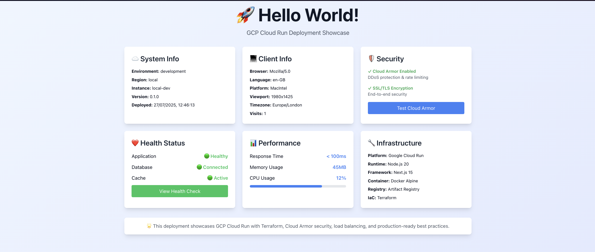

# Hello World GCP Cloud Run Module

A comprehensive, production-ready Hello World application deployed on Google Cloud Platform using Cloud Run and Terraform, showcasing enterprise-grade security and monitoring features.



## Architecture

- **Application**: Enhanced Next.js app with system monitoring
- **Container Registry**: Google Artifact Registry
- **Deployment**: Google Cloud Run with auto-scaling
- **Load Balancer**: Global HTTP(S) Load Balancer
- **Security**: Cloud Armor with DDoS protection and rate limiting
- **Infrastructure**: Terraform with enterprise best practices
- **Monitoring**: Built-in health checks and system metrics

### Container Architecture Diagram


*Complete infrastructure overview showing Cloud Run, Load Balancer, Cloud Armor, and security components*

## Project Structure

```
├── .github/                 # GitHub Actions CI/CD workflows
│   └── workflows/
│       ├── deploy.yml       # Production deployment pipeline
│       ├── terraform-plan.yml # Infrastructure validation
│       ├── dockerfile-validation.yml # Docker security scanning
│       └── pythonformatting.yml # Code quality checks
├── infra/                    # Terraform infrastructure code
│   ├── artifact_registry.tf  # Container registry configuration
│   ├── backend.tf            # Terraform backend and providers
│   ├── cloud_armor.tf        # Security policies and DDoS protection
│   ├── cloud_run.tf          # Cloud Run service configuration
│   ├── dockerfile            # Multi-stage Docker build
│   ├── iam.tf               # Service accounts and permissions
│   ├── load_balancer.tf      # Global load balancer and SSL
│   ├── outputs.tf           # Infrastructure outputs
│   ├── variables.tf         # Variable definitions
│   └── vars/
│       └── dev.tfvars       # Environment-specific values
├── src/                     # Next.js application source
│   ├── app/
│   │   ├── api/             # API endpoints for system info
│   │   ├── health/          # Health check dashboard
│   │   ├── page.tsx         # Enhanced main dashboard
│   │   └── layout.tsx       # Application layout
├── package.json             # Application dependencies
├── next.config.ts           # Next.js configuration
├── tailwind.config.js       # Tailwind CSS configuration
├── postcss.config.mjs       # PostCSS configuration
└── tsconfig.json           # TypeScript configuration
```

## Quick Start

### 🏠 Local Development

1. **Install Dependencies**
   ```bash
   npm install
   ```

2. **Run Development Server**
   ```bash
   npm run dev
   ```
   The application will be available at `http://localhost:3000`

3. **Build for Production (Optional)**
   ```bash
   npm run build
   npm start
   ```

4. **Test with Docker (Optional)**
   ```bash
   # Build Docker image locally
   docker build -f infra/dockerfile -t hello-world-local .

   # Run container locally
   docker run -p 3000:3000 hello-world-local
   ```

### ☁️ GCP Deployment

1. **Prerequisites**
   - Install [Google Cloud CLI](https://cloud.google.com/sdk/docs/install)
   - Install [Terraform](https://terraform.io/downloads)
   - Install [Docker](https://docs.docker.com/get-docker/)
   - Authenticate with GCP: `gcloud auth login`
   - Set your project: `gcloud config set project YOUR_PROJECT_ID`

2. **Update Configuration**
   ```bash
   cd infra/
   # Edit vars/dev.tfvars with your GCP project details
   ```

3. **Deploy Infrastructure**
   ```bash
   terraform init
   terraform plan -var-file=vars/dev.tfvars
   terraform apply -var-file=vars/dev.tfvars
   ```

4. **Build and Deploy Application**
   ```bash
   # Build Docker image
   IMAGE_NAME="europe-west2-docker.pkg.dev/YOUR_PROJECT/hello-world-repo/hello-world-app:latest"
   docker build -f infra/dockerfile -t $IMAGE_NAME .

   # Configure Docker for Artifact Registry
   gcloud auth configure-docker europe-west2-docker.pkg.dev

   # Push to Artifact Registry
   docker push $IMAGE_NAME

   # Application is automatically deployed via Terraform
   ```

## Configuration

### Required Variables (vars/dev.tfvars)

```hcl
project_id               = "your-gcp-project-id"
region                  = "europe-west2"
zone                    = "europe-west2-a"
environment             = "dev"
repository_id           = "hello-world-repo"
service_name            = "hello-world-app-dev"
service_account_name    = "sa-hello-world-dev"
container_image         = "europe-west2-docker.pkg.dev/your-project/hello-world-repo/hello-world-app:latest"
container_port          = 3000
min_instance_count      = 1
max_instance_count      = 3
```

## Features Showcase

### 🛡️ Security Features
- **Cloud Armor**: DDoS protection, rate limiting, geo-blocking
- **SSL/TLS**: Managed certificates with automatic renewal
- **IAM**: Least-privilege service account permissions
- **Container Security**: Non-root user, minimal Alpine base
- **Network Security**: Private Cloud Run with load balancer ingress

### 📊 Monitoring & Observability
- **Health Checks**: Comprehensive system health monitoring
- **System Metrics**: Real-time performance and resource usage
- **Request Tracking**: Client information and visit counters
- **Environment Info**: Deployment details and configuration
- **API Endpoints**: RESTful endpoints for system information

### 🚀 Performance Features
- **Auto-scaling**: 1-3 instances based on demand
- **Global Load Balancer**: Worldwide content delivery
- **Container Optimization**: 3-stage Docker builds with distroless final image
- **Caching**: Efficient resource utilization
- **Minimal Attack Surface**: Distroless production image (~50MB vs ~200MB)
- **Fast Cold Starts**: Optimized for Cloud Run startup performance

### 🔄 CI/CD Pipeline
- **Automated Deployment**: GitHub Actions for seamless deployments
- **Infrastructure Validation**: Terraform plan and validation on PRs
- **Security Scanning**: Docker image vulnerability scanning with Trivy
- **Code Quality**: ESLint, Prettier, and TypeScript checks
- **Multi-Environment**: Support for dev/prod environments

## Local Development Features

When running locally, the application provides:

- **System Information**: Shows local development environment details
- **Health Checks**: Simulated health status and metrics
- **API Endpoints**: All endpoints work with mock data
- **Hot Reload**: Next.js development server with instant updates
- **TypeScript**: Full type checking and IntelliSense support

### Available Routes
- `/` - Main dashboard with system information
- `/health` - Health check page with component status
- `/api/system-info` - System information JSON endpoint
- `/api/test-endpoint` - Test endpoint for Cloud Armor simulation

## Best Practices Implemented

- **Terraform**: Separate files for logical components, no default values in variables.tf
- **Docker**: 3-stage builds with distroless runtime, security scanning, minimal dependencies
- **Infrastructure**: Modular design, proper resource naming, comprehensive outputs
- **Application**: Production-ready Next.js configuration with standalone output

## Monitoring & Logs

Access logs and metrics through:
- Google Cloud Console > Cloud Run
- Google Cloud Console > Cloud Logging
- Google Cloud Console > Cloud Monitoring

## Docker Image Optimization

### 🐳 Multi-Stage Build Strategy

The Dockerfile uses a **3-stage build** process for maximum optimization:

1. **Dependencies Stage** (`deps`)
   - Installs only production dependencies
   - Uses `npm ci --omit=dev` for faster, reproducible builds
   - Cleans npm cache to reduce layer size

2. **Build Stage** (`builder`)
   - Installs all dependencies (including devDependencies)
   - Builds the Next.js application with standalone output
   - Removes unnecessary files after build

3. **Production Stage** (`production`)
   - Uses **Google Distroless** base image for ultimate security
   - Only contains Node.js runtime and application code
   - No shell, package managers, or unnecessary tools
   - Runs as non-root user (`nonroot`)

### 📊 Size Comparison

| Image Type | Size | Security | Performance |
|------------|------|----------|-------------|
| Traditional Node.js | ~400MB | Medium | Slower startup |
| Alpine Multi-stage | ~120MB | Good | Fast startup |
| **Distroless (Ours)** | **~50MB** | **Excellent** | **Fastest startup** |

### 🔒 Security Benefits

- **No shell access** - Eliminates shell-based attacks
- **Minimal attack surface** - Only essential runtime components
- **Non-root execution** - Enhanced container security
- **No package managers** - Prevents runtime package installation
- **Vulnerability reduction** - Fewer components = fewer vulnerabilities

## Cleanup

```bash
terraform destroy -var-file=vars/dev.tfvars
```